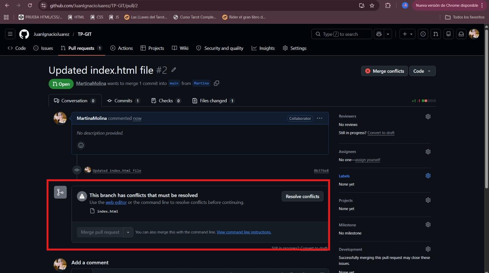
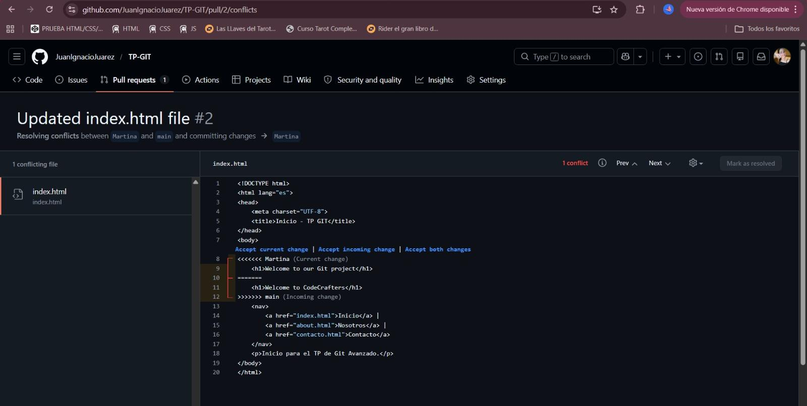
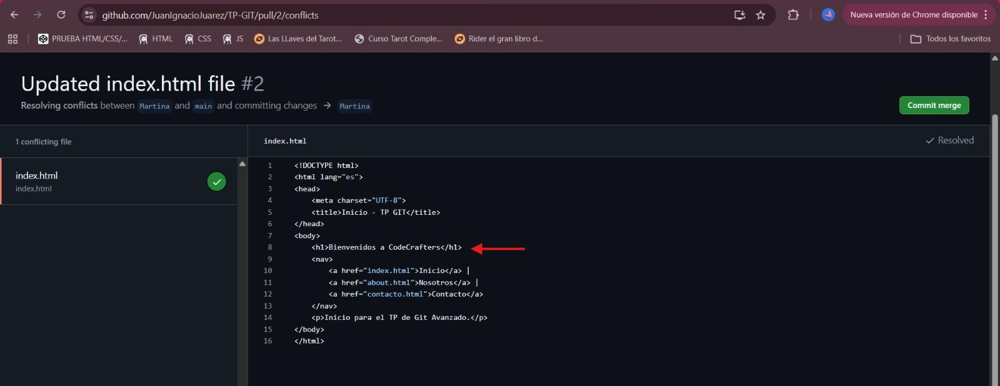
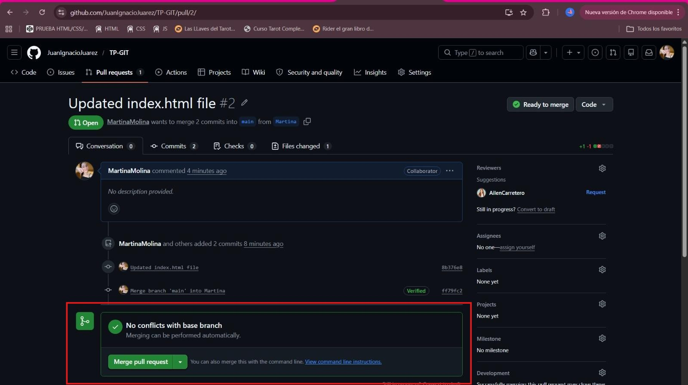
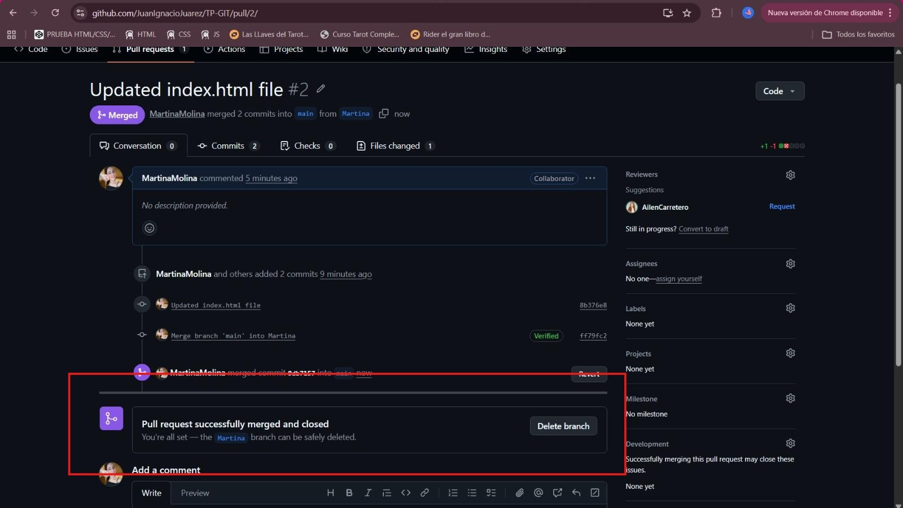
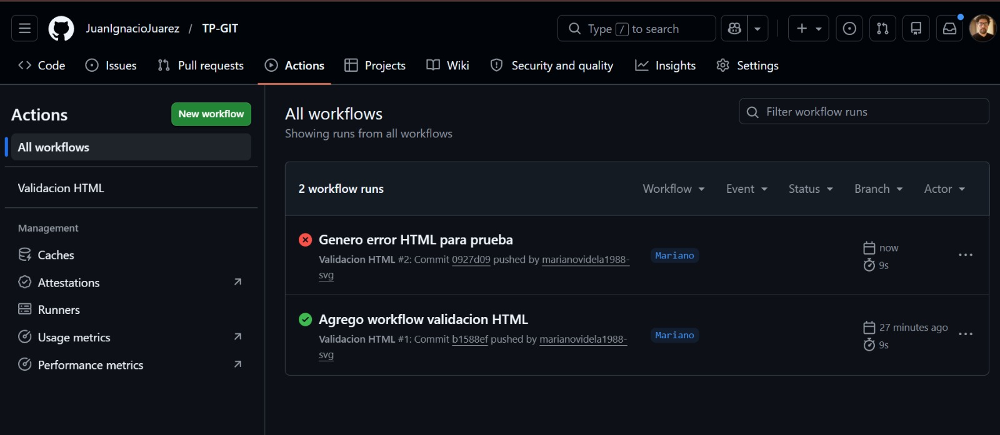
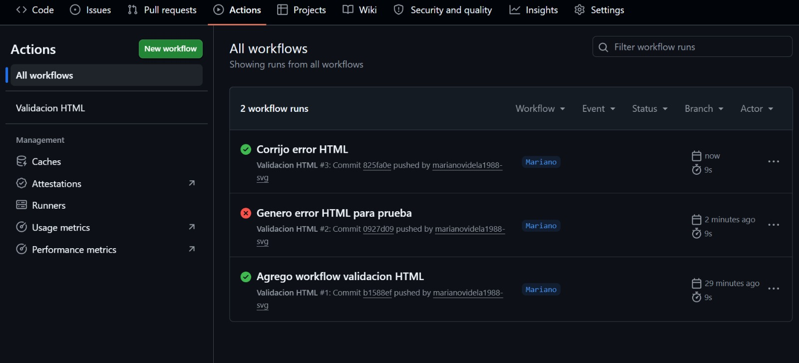
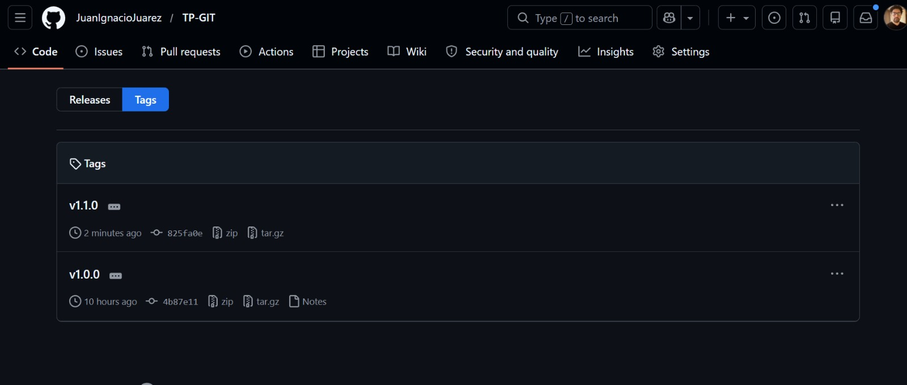

# 🧩 Resolución de conflicto en Pull Request

Se realizó un Pull Request (PR) desde una rama feature hacia la rama `main`. Durante el intento de merge, GitHub detectó un conflicto en el archivo `index.html`, debido a modificaciones concurrentes sobre la misma sección del código.

---

## 1. Detección del conflicto

Al iniciar el merge del PR, la plataforma indicó la existencia de conflictos que impedían la integración automática. Esto ocurre cuando dos ramas modifican las mismas líneas sin una base común compatible.



---

## 2. Visualización del conflicto

GitHub permitió acceder al editor de resolución, donde se identificaron los bloques conflictivos delimitados por las marcas:

```html
<<<<<<< HEAD
=======
>>>>>>> main
```

Estas marcas representan:
- `HEAD`: versión de la rama actual
- `main`: versión entrante



---

## 3. Resolución del conflicto

Se procedió a analizar ambas versiones del código y seleccionar la alternativa correcta.  
En este caso, se modificó la línea en conflicto (línea 8 del archivo), reemplazando el contenido por una única versión válida y eliminando las marcas de conflicto.

Esto permitió unificar el código y garantizar consistencia en el archivo.



---

## 4. Confirmación de cambios

Una vez resuelto el conflicto:

- Se marcó el archivo como resuelto (`Mark as resolved`)
- Se realizó el commit de merge (`Commit merge`)

Este commit registra la resolución manual del conflicto dentro del historial del repositorio.

---

## 5. Finalización del Pull Request

Con el conflicto resuelto, GitHub habilitó la opción de completar el merge del PR:



Se ejecutó correctamente el **Merge Pull Request**, integrando los cambios en la rama `main` y cerrando el PR de forma automática.



---

# ⚙️ Validación mediante GitHub Actions

Se implementó un workflow de validación automática de archivos HTML utilizando GitHub Actions.

El workflow se ejecuta ante cada `push` y realiza:

- Clonado del repositorio
- Instalación de la herramienta `HTMLHint`
- Validación de los archivos `.html`

---

## 6. Pruebas del workflow

Se realizaron ejecuciones para verificar el comportamiento del workflow:

- Una ejecución con error (HTML inválido)



- Una ejecución exitosa (HTML corregido)



Esto permitió validar el correcto funcionamiento del control automatizado.

---

# 🏷️ Versionado del proyecto

Se crearon etiquetas (tags) para identificar versiones del repositorio:

- `v1.0.0`
- `v1.1.0`

Estas permiten marcar hitos del desarrollo y facilitar la trazabilidad del proyecto.

